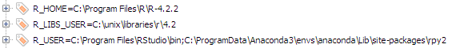

# Using R Packages in Python Notebooks

It is often the case that while coding an analysis on Python we wish to implement some functionality, or call a given service, only to discover through a quick Google search that there is a perfect `R` package that does what we need, but neither `pip` nor ==anaconda/conda-forge or github provides us with a comparably good solution.

For me was calling and using `R`'s wonderful `eurostat` package[^1]. `giscoR`[^2] is also another great better-in-R package example. Importing standard NUTS regions boundaries for a geospatial analysis notebook is better implemented in this package than on any other in python.

But how to get it working in a python notebook? Through the python `rpy2` package

## Preparation
Before jumping to cutting and pasting commands, you need to do the following:

* In windows:
  1. Create the following system variables:
      * `R_USER` : 
      * `R_HOME` :
      * `R_USER_LIBS` : 

  

* In linux:

## rpy2 package

## rwrap package

## All together

[^1]: [Tools for Eurostat Open Data - eurostat (ropengov.github.io)](https://ropengov.github.io/eurostat/)
[^2]: [rOpenGov/giscoR: Download geospatial data from GISCO API - Eurostat (github.com)](https://github.com/ropengov/giscoR)

